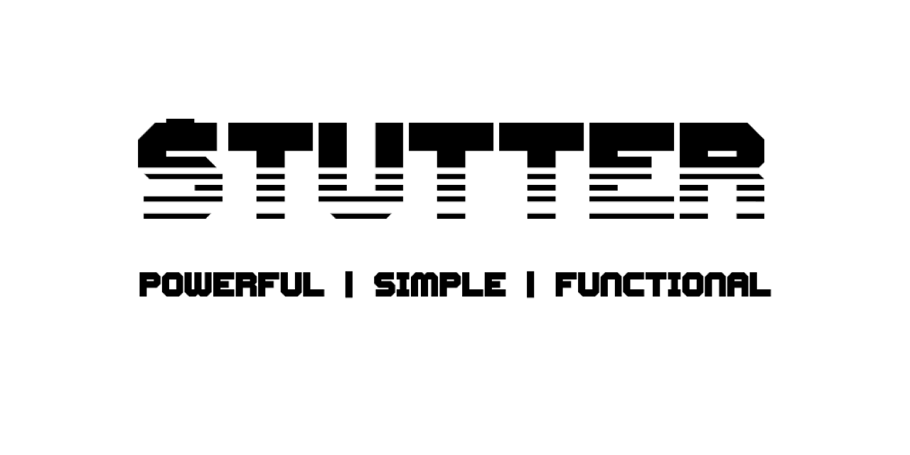

[Website](https://stutter.io) • [Guide](docs/GUIDE.md) • [Full API documentation](docs/API.md)

**PLEASE NOTE: THIS PROJECT IS STILL UNDER DEVELOPMENT**

## Why?

We're big fans of both lodash and ramda. But after years of use there are
particular sets of problems that we wanted solutions to.
- Autocurrying is a pitfall without helpful guiderails
- Sometimes you want data first, sometimes you want function first. There's use
  cases for both!
- Why is support for Promises not built in? Do I really need yet another library
  (`async`)?
- How come I can't use these functions with generators?
- Why do I need separate functions for sync and async?
- When using curried functions, it's impossible to tell where in my code an
  error really came from.
- Why don't I get an meaningful error when I accidentally feed the wrong type to
  a function?


## Features

### Supports sync, async AND generator functions

We believe you shouldn't have to use a different `map` function when you're
mapping using an async function, generator function or a standard function. The
method should be able to naturally upgrade to match the requirements based upon
the iteratee function that YOU give it. That's why our functions will support
any of these options and return you the appropriate matching type. This makes
stutter compatible for use with such libraries as [`redux-saga`](https://redux-saga.js.org/)

**Standard function will run synchronously**
```js
import { map } from 'stutter'

map([1, 2, 3], (value) => value + 1)
//=> [2, 3, 4]
```

**Async functions will upgrade and return a Promise**
```js
const result = await map([1, 2, 3], async (value) => value + 1)
//=> [2, 3, 4]
```

**Generator functions will upgrade and return a Generator**
```js
const result = yield* map([1, 2, 3], function* (value) {
  return value + 1
})
//=> [2, 3, 4]
```


### Data first AND function first

Stutter supports both data first AND function first (lodash style and ramda
style). We're able to do this because stutter supports [multi-functions](#multi-functions).
Multi-functions in stutter are matched based upon parameter types which means it
can tell when you've put the function first and when you've put the data first.

**function first**
```js
import { reduce } from 'stutter'

reduce(
  (accum, value) => accum + value,
  0,
  [1, 2, 3]
)
// => 6
```

**data first**
```js
import { reduce } from 'stutter'

reduce(
  [1, 2, 3],
  0,
  (accum, value) => accum + value
)
// => 6
```


### Multi-functions

Stutter supports multi-functions with [type delcarations](#type-delcarations). This enables you to
create a single function that will execute the correct implementation based on
which arguments are given to it.

```js
import { fn } from 'stutter'

const add = fn(
  [String, Number],
  (str, num) => parseInt(str) + num,

  [Number, String],
  (num, str) => num + parseInt(str),

  [Number, Number],
  (num1, num2) => num1 + num2
)

add('9', 1)
// => 10

add(9, '1')
// => 10

add(9, 1)
// => 10
```

### Type declarations

Stutter's methods are capable of accepting type defintitions so that it knows
what kind of data a function is meant to handle. 
This alerts you to problems when the wrong type of data is encountered or when a matching
  function signature cannot be found.

```js
const add = fn(
  [Number, Number],
  (num1, num2) => num1 + num2
)

add(1, 2)
// => 3

add('foo', 2)
// Throws "TypeError"
```


### Auto curried with type hinting

All functions are automatically curried. However, we do this in conjunction with
type checking to help sort out issues where a curried function has received the
wrong type.
Automatic currying also works for all forms of a multi-function, making it
possible to curry mixed function signatures.

```js
import Immutable from 'immutable'
import { fn } from 'stutter'

const concat = fn(
  [Array, Array],
  (arr1, arr2) => arr1.concat(arr2),

  [Array, Immutable.List],
  (arr, list) => arr.concat(list.toJs())
)

const mistake = concat(null)
//=> Throws "TypeError"

const concatFoo = concat(['foo'])

concatFoo(['bar'])
//=> ['foo', 'bar']

concatFoo(Immutable.List(['bar']))
//=> ['foo', 'bar']

concatFoo(null)
//=> Throws "TypeError"
```


### All operations are Immutable

All operations perfomed in stutter are immutable. This makes your code much
easier to reason about and prevents nasty bugs caused by mutability.

```js
import { assoc } from 'stutter'

const obj1 = { a: 1, b: 2 }
const obj2 = assoc('c', 3, obj1)

obj1
//=> { a: 1, b: 2 }
obj2
//=> { a: 1, b: 2, c: 3 }

const map1 = new Map([['a', 1], ['b', 2]])
const map2 = assoc('c', 3, map1)

map1
//=> Map { a: 1, b: 2 }
map2
//=> Map { a: 1, b: 2, c: 3 }
```


### Supports Immutable.js and ES6 data types

Stutter is built on top of [Immutable.JS](https://facebook.github.io/immutable-js/) data
structures but supports both Immutable.JS data types and standard JS values
(including ES6 Map, WeakMap, Set and WeakSet).
This makes it easy to handle mixed nested data types making it easier to process values of mixed Immutable.JS/mutable data objects

```js
import { get } from 'stutter'
import Immutable from 'immutable'

// Immutable.JS example
const map = Immutable.Map({ a: 1, b: 2 })

get('b', map)  
//=> 2

// Standard JS Object example
const obj = { a: 1, b: 2 }

get('b', obj)    
//=> 2

// Mixed Standard and Immutable values
const mixed = { 
  a: Immutable.Map({ 
    c: 3, 
    d: 4 
  }), 
  b: 2 
}
get('a.c', mixed)
//=> 3
```

### Custom data types
- supports custom data types for [Immutable.JS](https://facebook.github.io/immutable-js/)


### Contagion support

Types are contagious across deep operations. When a deep operation is performed
on a value that generates a new value, that new value will be of the same or similar
"type". For instance, if you do a deep `assocIn` to an `ImmutableMap` the newly
generated nested object will be an ImmutableMap

```js
import { assocIn } from 'stutter'
import Immutable from 'immutable'

assocIn(Immutable.Map({}), ['foo', 'bar'], 'baz')
//=> ImmutableMap { foo : ImmutableMap { bar: 'baz' }}

assocIn(Map(), ['foo', 'bar'], 'baz')
//=> Map { foo : Map { bar: 'baz' }}

assocIn({}, ['foo', 'bar'], 'baz')
//=> Object { foo : Object { bar: 'baz' }}
```


### Protocols

Having a library with built in support for common data types like native JS
types is great. However, there are times you want to extend the type of data
that a function can support without having to write your own and then replace all
of the uses of that function. Using Protocols you can easily teach `stutter` how
to deal with new types of data.

**Teach stutter about a custom type and how to integrate with its `add` method**
```js
import { add, deftype, fn } from 'stutter'

class Custom {
  constructor(value) {
    this.value = value
  }
  add(num) {
    return new Custom(this.value + num)
  }
  toNumber() {
    return this.value
  }
}

deftype('Custom', 'A custom addable type', {
  class: Custom,
  protocols: [
    add.protocol,
    {
      add: fn(
        [Self, Number, () => Self], 
        (self, num) => self.add(num),

        [Number, Self, () => Number], 
        (num, self) => num + self.toNumber()
      )
    }
  ]
})
```


### Built in threading (piping) macros

**Basic threading macro**
```js
import { _, invert, set } from 'stutter'

const obj = { a: 1, b: 2 }

_(obj, 
  set('c', 3),
  invert) 
//=> Object { 1: "a", 2: "b", 3: "c" }
```

**Reusable pipelines**
```js
import { _, invert, set } from 'stutter'

const obj = { a: 1, b: 2 }

const pipeline = _
  .set('c', 3)
  .invert()

pipeline(obj)
//=> Object { 1: "a", 2: "b", 3: "c" }
```

**Pre-filled pipeline**
```js
import { _, invert, set } from 'stutter'

const obj = { a: 1, b: 2 }

const prefilled = _(obj)

prefilled(
  set('c', 3), 
  invert) 
//=> Object { 1: "a", 2: "b", 3: "c" }
```


## Project Status

[](https://badge.fury.io/js/stutter)<br />
[](https://travis-ci.org/brianneisler/stutter)<br />
[](https://nodei.co/npm/stutter/)


## Documentation

[Guide](docs/GUIDE.md) - A guide to getting started and using stutter
[Full API documentation](docs/API.md) - Learn about each method


## Install

```sh
npm install --save stutter
```


## Usage

Simply import the functions you want to use into your project.
```js
import { map, set } from 'stutter'
```
